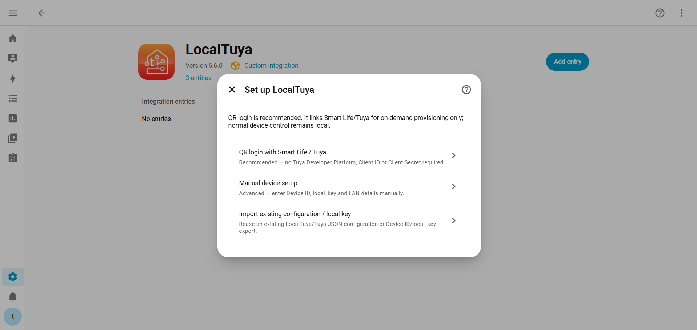
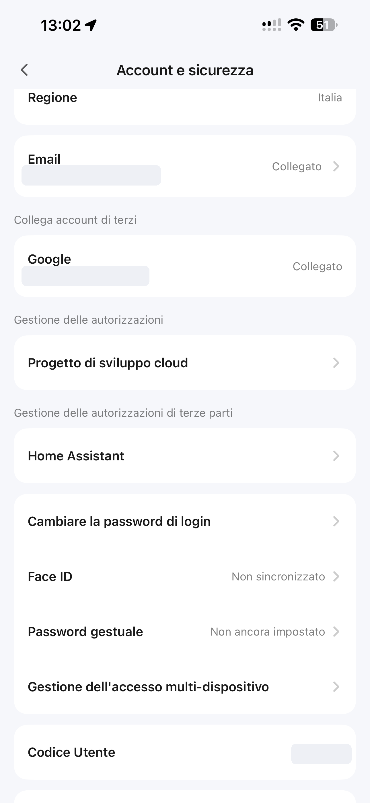
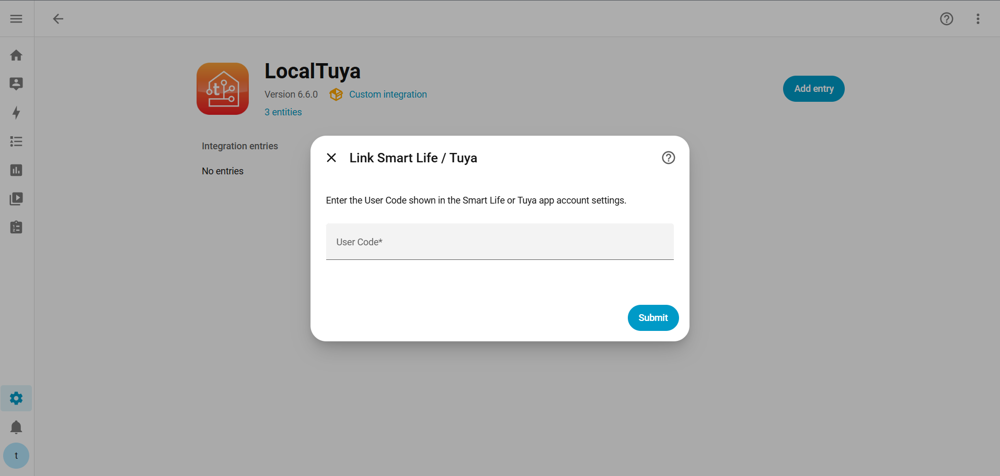
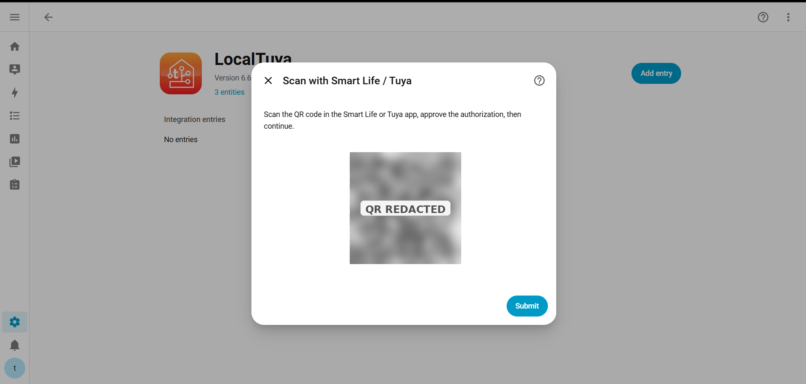
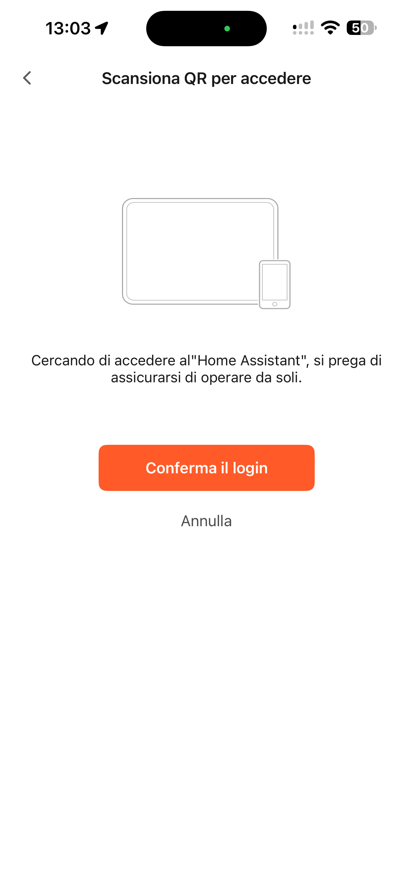
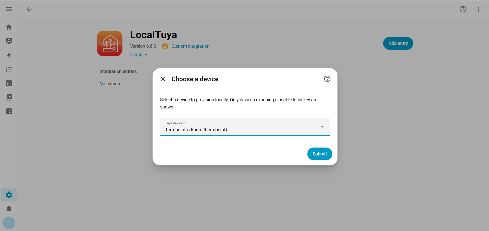
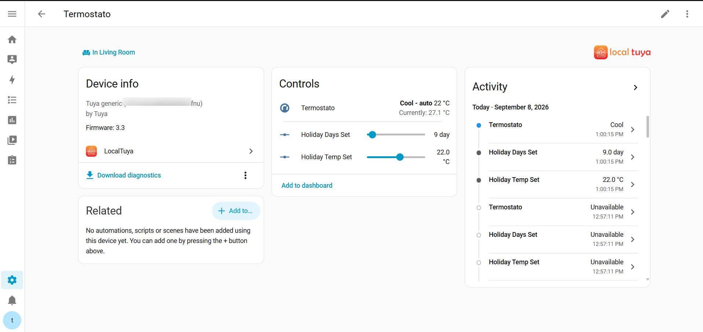

# Smart Life / Tuya QR setup guide

LocalTuya 6.6.0 introduces a recommended onboarding flow that links your Smart Life / Tuya account by QR **only for provisioning**.

You do **not** need a Tuya Developer Platform project, Client ID, Client Secret or Data Center configuration for the normal setup path.

After a device is provisioned, normal control remains local over the LAN.

> Screenshots in this guide are privacy-redacted. User Codes, account details, QR authorization data and device identifiers are not published.

## Before you start

Make sure that:

- LocalTuya 6.6.0 or newer is installed.
- Home Assistant is on the same LAN as the Tuya device, or can route to it directly.
- The device is already paired in the Smart Life or Tuya mobile app.
- The device is powered on and online.
- You can open the Smart Life / Tuya mobile app while completing the setup.

A Home Assistant backup is recommended before changing integrations on a production system.

## 1. Add LocalTuya

In Home Assistant, open:

**Settings → Devices & services → Add integration → LocalTuya**

Choose:

**QR login with Smart Life / Tuya**

This is the recommended setup method. Manual setup and configuration import remain available for advanced use.

## 2. Find your Smart Life / Tuya User Code

Open the **Smart Life** or **Tuya Smart** mobile app and go to the account/security settings.

The exact menu wording can vary by app version and region, but look for **User Code** / **Codice Utente**.

The screenshot below shows the location in Smart Life. The real User Code and account details have been redacted.

  

Copy the User Code.

> Do not publish your User Code in issues, logs or screenshots.

## 3. Enter the User Code in Home Assistant

Return to Home Assistant and paste the User Code into the LocalTuya setup screen.

Press **Submit** / **Continue**.

LocalTuya starts a temporary Tuya account-linking session and generates a QR code.

## 4. Scan and approve the QR login

Home Assistant now shows a QR code.

Open Smart Life / Tuya on your phone, scan the QR code and approve the authorization request.

> A live QR code contains temporary authorization data. Do not publish a valid QR code. The QR shown in this documentation has been made non-usable.

Smart Life / Tuya will show a confirmation page similar to this:

  

Tap **Confirm login** / **Conferma il login**, then return to Home Assistant and continue.

## 5. Choose the device

After authorization succeeds, LocalTuya retrieves eligible devices from the linked Smart Life / Tuya account.

Only devices exposing credentials suitable for local control are shown.

Select the device you want to add.

LocalTuya then attempts to:

1. Resolve the device on the LAN.
2. Authenticate locally with the selected Device ID and `local_key`.
3. Detect the Tuya protocol automatically.
4. Read the device datapoints.
5. Match the device against the LocalTuya Community Device Catalog and safe automatic mapper.

The device is **not saved** until local validation succeeds.

## 6. Review mappings if requested

For many supported devices, LocalTuya can create the required entities automatically.

When a trusted product-specific catalog mapping matches, the catalog mapping is authoritative and the generic mapper only fills safe gaps.

If Home Assistant shows **Review suggested mappings**:

- high-confidence mappings are already included;
- additional medium-confidence mappings may be offered for review;
- ambiguous capabilities are not guessed automatically.

Select only the extra entities you want, then continue.

## 7. Finish setup

Once LAN validation and mapping complete, Home Assistant creates the LocalTuya device and its entities.

You can now assign the device to an Area and use it normally in Home Assistant.

Normal runtime control is local. The saved Smart Life / Tuya authorization is retained only so LocalTuya can provision additional devices later without requiring a new QR scan every time.

## Adding another device later

You normally do not need to repeat the QR login while the saved authorization remains valid.

Open:

**Settings → Devices & services → LocalTuya → Configure**

Choose:

**Add a new device**

Then choose the Smart Life / Tuya provisioning path.

LocalTuya refreshes the linked account and shows eligible devices that are not already configured.

If the authorization has expired, LocalTuya asks you to link the account again by QR.

## Existing LocalTuya installation

If you already use LocalTuya 6.5.x or another supported 6.x configuration, you do **not** need to delete the integration.

Open LocalTuya options and choose:

**Link Smart Life / Tuya account by QR**

Your existing LAN devices and mappings remain intact.

If the entry previously used the legacy Tuya Developer Platform cloud configuration, explicitly linking by QR migrates that entry to the provisioning-only model. Existing local devices remain configured.

## If automatic LAN discovery fails

Some networks block or do not propagate Tuya UDP discovery correctly. This is common with:

- VLANs;
- Docker/container networking;
- restrictive access points;
- unusual broadcast/multicast filtering.

When LocalTuya cannot determine a usable address automatically, it asks for the current device **IP address or hostname** instead of accepting an unverified address.

Find the address in your router/DHCP client list and enter it in Home Assistant.

This does not bypass validation. LocalTuya still has to authenticate to that exact device, auto-detect the protocol and read its datapoints before the configuration can be saved.

A DHCP reservation is recommended so the device address does not change later.

## Common errors

### “The selected device was not found on the Home Assistant LAN”

Check that:

- the device is powered on;
- Home Assistant can route to the device network;
- Wi-Fi client/AP isolation is disabled when both endpoints need to communicate;
- the device IP is still current;
- VLAN/firewall rules allow direct LAN traffic.

If LocalTuya offers manual IP/hostname entry, use the current address from the router.

### “Cannot connect to device”

The selected or manually entered address could not complete LocalTuya's direct LAN validation.

Check the current DHCP address, confirm the device is online and close/force-stop Smart Life while testing local connectivity if the device only permits a limited number of simultaneous local sessions.

### “Failed to authenticate with device”

The network address is reachable, but the Device ID / `local_key` pair could not authenticate successfully.

Re-link/reprovision the account or verify that the selected device has not been reset/re-paired since its credentials were obtained.

### No devices are shown

The account may contain only devices that do not expose usable local credentials, unsupported child devices, or devices that are already configured in this LocalTuya entry.

### Hub child device is rejected

The QR onboarding flow currently rejects unsupported hub child devices until LocalTuya has a tested local child-device transport model.

### QR authorization expired

Open LocalTuya options and choose:

**Link Smart Life / Tuya account by QR**

Then repeat the User Code + QR approval step.

## Disconnecting the Smart Life / Tuya account

You can explicitly disconnect the linked account from LocalTuya options.

This removes the saved provisioning authorization but keeps already configured LAN devices, Device IDs, local keys, IP/protocol settings and mappings.

Already configured devices continue to work locally.

## Privacy when reporting problems

Before posting logs or screenshots publicly, remove or redact:

- `local_key`
- Tuya Device ID when not needed
- User Code
- QR code / QR token
- access/refresh tokens
- email address
- account IDs
- public/private IP information you do not want to disclose

LocalTuya diagnostics are designed to redact sensitive authorization material, but manually copied screenshots and logs should still be reviewed before publication.
